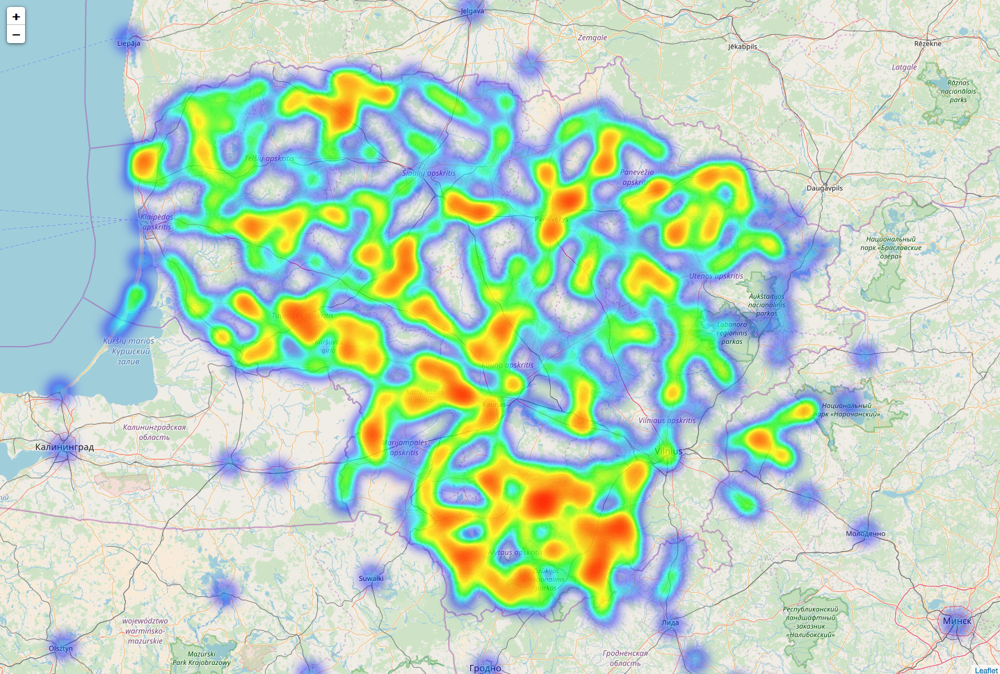

# Geographical heatmap using Python and folium
This peace of software allows you to generate geographical heatmaps by using data from your csv file.

### Usage
```
sage: geo_heatmap.py [-h] [-c CSV] [-o OUTPUT]
                      [-ml MAP_LOCATION [MAP_LOCATION ...]]
                      [-mzs MAP_ZOOM_START] [-hmr HEATMAP_RADIUS]
                      [-hmb HEATMAP_BLUR] [-hmmo HEATMAP_MIN_OPOCITY]
                      [-hmmz HEATMAP_MAX_ZOOM] [-mt TILES]

optional arguments:
  -h, --help            show this help message and exit
  -c CSV, --csv CSV     Path to CSV data file
  -o OUTPUT, --output OUTPUT
                        Path of html geographical heatmap
  -ml MAP_LOCATION [MAP_LOCATION ...], --map_location MAP_LOCATION [MAP_LOCATION ...]
                        Latitude and Longitude of Map (Northing, Easting)
  -mzs MAP_ZOOM_START, --map_zoom_start MAP_ZOOM_START
                        Initial zoom level for the map
  -hmr HEATMAP_RADIUS, --heatmap_radius HEATMAP_RADIUS
                        Heatmap radius of each “point” of the heatmap
  -hmb HEATMAP_BLUR, --headmap_blur HEATMAP_BLUR
                        Heatmap amount of blur
  -hmmo HEATMAP_MIN_OPOCITY, --heatmap_min_opocity HEATMAP_MIN_OPOCITY
                        Heatmap minimum opacity the heat will start at
  -hmmz HEATMAP_MAX_ZOOM, --heatmap_max_zoom HEATMAP_MAX_ZOOM
                        Heatmap max zoom
  -mt TILES, --map_tiles TILES
                        Map tileset to use

```

### CSV file structure
To generate geographical heatmap you must providecsv file with data. Expected csv file consists of fields:
* name - name of entity
* lat - latitude of entity
* lon - longitude of entity
* magnitude - some numerical value that represents entity size/frequency

File structure sample:
```
name;lat;lon;magnitude
kaunas;54.901308;23.901188;1500
vilnius;54.687269;25.266001;1300
alytus;54.395370;24.037830;570
panevėžys;55.740698;24.371294;860
klaipėda;55.711837;21.133854;810
```

### Default parameters

Path to CSV data file - heatmap.csv  
Path of html geographical heatmap - geo_heatmap.html  
Latitude and Longitude of Map (Northing, Easting) - ['55.0', '24.0']  
Initial zoom level for the map - 7  
Heatmap radius of each “point” of the heatmap - 5  
Heatmap amount of blur - 5  
Heatmap minimum opacity the heat will start at - 0.2  
Heatmap max zoom - 4  
Map tileset to use - 'OpenStreetMap'  

### Example
```
>>> python geo_heatmap.py -hmr 100 -hmb 8 -hmmo 0.1
```

####Output

